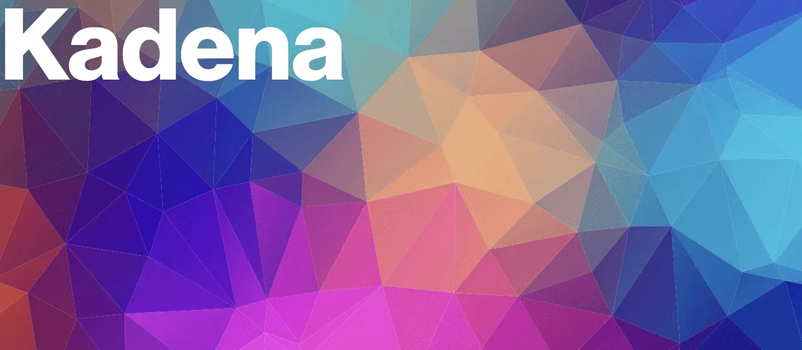
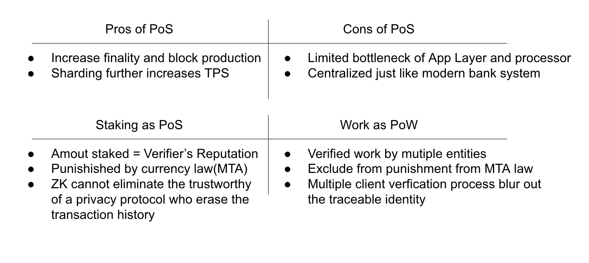
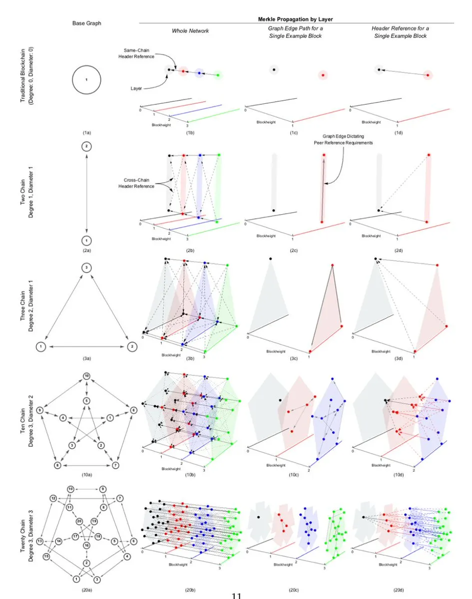
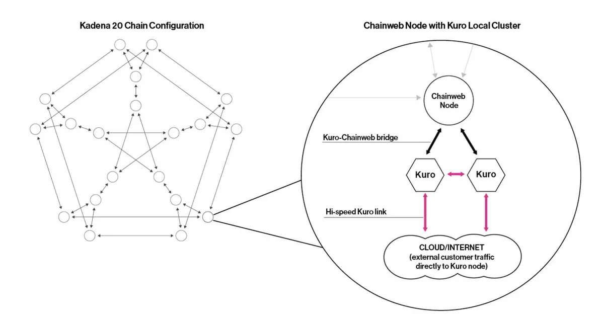

# 🕸 uDAG Layer1: Kadena

*✍️ edit: April 3rd, 2023*

## Intro

[**KDA**](https://kadena.io/) scaled from 10 parachains to 20 parachains at the end of 2019, and its throughput reached 480,000 TPS, which is 9 times that of Solana. Its expansion and upgrade history also proves the possibility of its infinite expansion. It uses the Blake2s algorithm, which is faster, quantum-resistant and more secure than SHA256.

## Grounding on Proof of Work

KDA always insists on using PoW and believes that data capacity and security are always the innovative blockchain technology. Although the current development of public chains, including Ethereum's Merge, is turning to the new pledged consensus (PoS), it is undeniable that blockchain technology will become the largest settlement and accounting network. The advantages and disadvantages of PoW and PoS will become more and more intense with the legalization of blockchain technology.

### Pros & Cons of PoW

## Native Cross-chain Assets

KDA's cross-chain assets can safely implement native cross-chain on 20 chains under non-trust conditions. At present, KDA adopts the SPV simplified bookkeeping proof. KDA verifies the new assets generated by the transfer-in chain by destroying the assets on the transfer-out chain. The following steps guarantee the specific security:

1. Proof of destruction before generation: Newly generated token transactions must accept and prove that old assets transferred out of the chain have been destroyed

2. One-to-one destruction generation mechanism: After the asset is destroyed, a unique verification ID is generated, and there is only one chance to verify the generated asset

3. Interruption mechanism: Owners only need to sign and destroy, and additional clearing services are required to complete the cross-chain because this step does not involve hash root interaction.

4. These steps can be called in both UTXO (Bitcoin bookkeeping) and bookkeeping verification (Ethereum bookkeeping), and KDA adopts bookkeeping verification.

## Core Technology

KDA perfectly uses the "degree-diameter model" to solve undirected regular graphs, and uses mathematical graph theory design to achieve the best and highest throughput under constant computing power. Each chain verifies the hash root referenced from the other three chains. The hash root referenced by the three chain verification simultaneously constitutes a complete Merkle hash root that maintains each other. Finally, unlimited expansion reaches the theoretical hardware bandwidth limit of the Internet. It is not difficult to see that 3D models must be used to understand their operating principles as the number of chains increases. The core technologies are interpreted as follows:

- Each dot represents a chain, and the number of chains represents throughput and computing power

- The number of radians and chains determines the number of hash roots that each chain needs to reference and the number of blocks to verify the header

- Each edge represents the connected blocks that each chain must verify

- The design of the plane determines the efficiency and completely builds the interoperability of the Merkle hash root and multi-chain

- Interoperability includes the block height, and the size of the hash root referenced by each chain determined according to the block height (the integrity of the verified hash root)

## Pact Language

Pact is the development language of KDA, which is based on the back-translation of the Lisp language that hackers love. Features are as follows:

- Atomic semantic execution, design/operation/storage errors will be automatically rolled back

- Confirm the execution of the transaction through pacts multiple steps and account numbers

- Unlike Solidity, Turing Incomplete

- Prevents loopholes in which developers intentionally or unintentionally cause infinite loops of contracts

- The code design is easy for ordinary people to read

## Hybrid Kuro side-chain

Each KDA node is connected to two Kuro second-layer private chains; each Kuro can provide 8,000TPS to improve throughput and can be extended to a Byzantine fault-tolerant mechanism mixed with the chain network. These high-throughput Kuro can provide node services for other public chains in a single or multi-cluster manner, such as Polkadot and Cosmos, which are already cooperating.

## Conclusion

Its original ecological AMM completed the upgrade on April 19th. When users are involved in the operation of cross-chain applications, they originally need to combine the operations of KDA from a certain chain to a certain chain and then realize the transaction. At the same time, the upgrade Pact is The developers integrated this feature. Since then, KDA has truly achieved seamless cross-chain operations regarding technology and user experience.
