# 🎮 GameFi 分析框架: X World Games

> 本文将以 X World Games 为例子，作为分析链游的框架

## **一、总摘要**

---

**项目简介:** [**XWG**](https://xwg.games/)（X World Games，以下简称：XWG）是一个区块链游戏平台，致力成为链游的 OpenSea。其代币$XWG 已经于 BSC 上发布。

- **产品:** 可扩展的 NFT 游戏平台，其产品包括游戏发行服务、NFT 交易平台、跨游戏协议端口和游戏创建工具。已发行游戏有 Dream Card V1 & V2
- **发展空间:** 未来开发更多游戏和签署更多原创动漫 IP，结合生态和丰富游戏内容来实现自治 DAO

### **团队背景**

- **传统游戏开发团队:** XWG 开发团队 2017 年曾运营一款活跃用户 100w+的日系动作手游《姬斗无双》。2019 年，XWG 以日本 ACG 风格为先导推出首个 NFT TCG 游戏项目“Dream Card”，并于 2021 年完成其 NFT 的“初代发售”。随后推出 Dream Card 的延展 V2 游戏 Auto-Battle RPG 版本

- **丰富游戏设计经验:** 此外，XWG 团队开发过近百款在线小游戏，有丰富的 Web2 游戏制作经验和敏锐的游戏嗅觉。XWG 的创始人 Fernando 有 10 多年的投资经验和对市场趋势的敏锐洞察力。他赞同将游戏、区块链、DeFi、ACG、NFT、元宇宙等所元素融合的想法，并希望创建一个原生区块链游戏生态

### **GameFi 定义**

- **游戏性(Game):** 包括游戏类型(休闲到硬核)，娱乐性质(策略，休闲，探险等),社交属性(称号，成就等)，游戏体验(故事，UI/UX，文化等)。所有能让玩家捕获娱乐价值(Entertainment)的属性

- **经济性(Fi):** 包括经济系统(代币/NFT 设计，金库，借贷，rebase), 通胀模型(供需质押，释放，销毁，流动性)。所有能让投资者捕获信息情绪价差的属性

### GameFi 历史

- **一代链游(2018-2020 年):** 随着头部 Defi 的兴起和 OpenSea 的 NFT 交易市场等基础建设的发展，CryptoKitty 引发了 NFT 售卖孵化合成形式链游热度

- **二代链游(2021 年):** 链上用户激增及公链/NFT/元宇宙估值的暴涨，CryptoBlades 和 Axie Infinity 引爆链上 NFT 回合制，P2E 的游戏模式
  新一代链游未来: 现在，整个 GameFi 市场已经回撤 50%到 90%，一些声音也在怀疑 GameFi 已经从一代的热潮中退去，而开发者和投资者正在寻找更新一代的游戏价值洼地。StepN, LetMeSpeSak 等现实虚幻结合的 X2E 链游也有了小爆发式增长。这些卡位在元宇宙与链游间的游戏就如中心化交易所 CEXs 的处境，解决了完全去中心化交易和 OTC 交易基础建设不全的问题

- **从 Web2 到 Web3 游戏:** 值得关注的是，因为 Web3 和链游的投资策略主要是以代币发布为主，绕过开发商的收益。这与传统投资投资锁定 2 年的期限不同，代币的分发往往在 1 年内开始解锁，投资者的投资角度和力度往往专注于早期投资，而二级投资反而因代币释放和市场情绪影响比较容易受到代币抛压的影响

### **亮点一: 可扩展游戏平台**

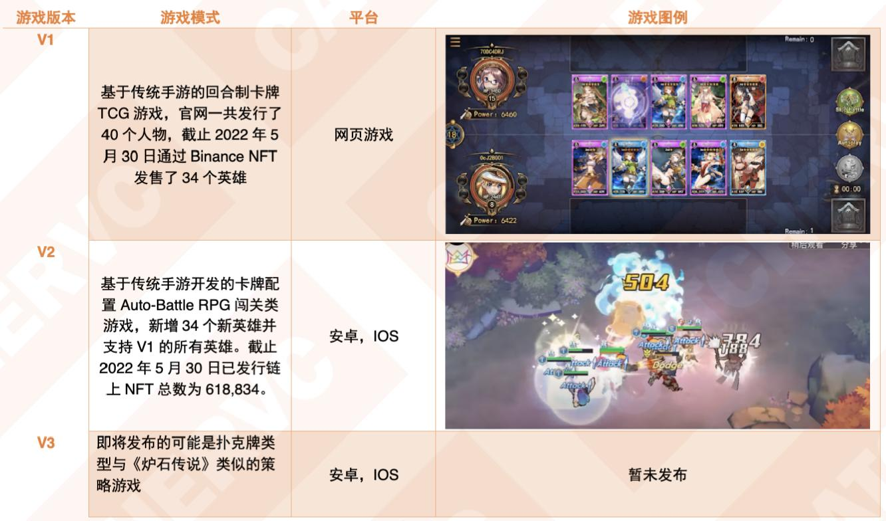

> _游戏可扩展性具有可持续发展性，并有能力在后期的游戏架构和经济系统上去弥补一些在 V1 或 V2 上的不足。在游戏经济稳定前提下，有希望增加 3D 建模，玩家自由定制 NFT 和元宇宙的 Social 属性。但跨平台 NFT 也在影响经济稳定。_

### **亮点二: 经济与游戏概率学**

- **代币机制:** 游戏内有丰富的内容设计和经济模型。目前项目的代币核心机制如下所示:

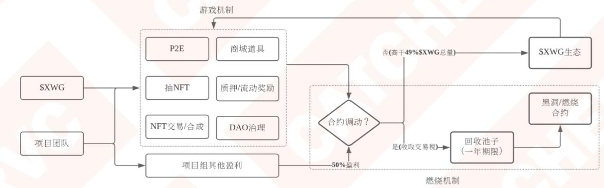

- **V1 机制:** 复杂性提高计算期望报酬率(E(r))的标准差(Sigma)成本, 包括多于 9 种随机变数，如 5 种属性相克，躲避率，暴击率，生命值，攻击力匹配能力值，攻击值，战斗冷却时间，图腾能力等。目前其战斗奖励惩罚机制如下所示:

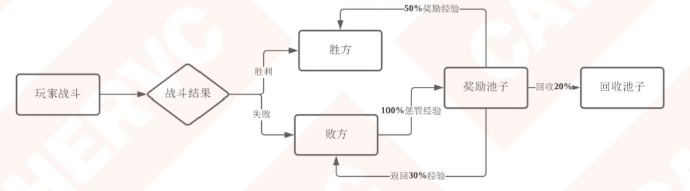

- **V2 机制:** V2 有五种职业如战士、法师、刺客、射手和牧师，且包含武器、装备、天赋系统升级的 PVE 闯关模式
- **双币系统:** 于 4 月 5 日发布双币系统，并通过 P2E2S 模式，销毁$LUCID游戏币用于升级及质押卡牌来减少$XWG 的抛压

> _目前产品定位是覆盖 PVP/PVE 模式的休闲娱乐游戏且复杂概率对打金战队有较高的壁垒，对休闲玩家较为友好。_

### **不足一: 模糊的休闲游戏属性**

XWG 作为一款休闲游戏，需要加强游戏学研究员[**Jesper Juul**](<https://en.wikipedia.org/wiki/Jesper_Juul_(game_researcher)>)游戏设计理论:

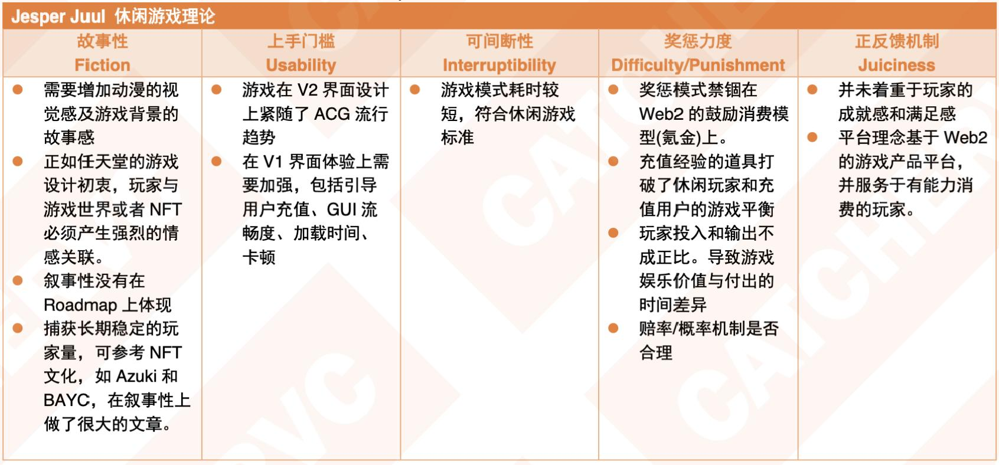

> _作为定位于休闲娱乐的链游仍需要注重增强休闲功能，以可持续的经济模型反馈给社区和玩家，同时削弱消费理念构建的经济体系注重增加活跃用户量和用户粘性。_

### **不足二: 未捕获二次元/ACG 玩家价值**

- **游戏冲动 Motivations:** 玩家因冲动而玩游戏，冲动的缘由定义了游戏品种。这些冲动包括: 动作竞技(使命召唤),社交属性(堡垒之夜)，即时策略(Dota2)，成就挑战(游戏速推)，沉浸体验(星际公民)，创作自由(我的世界)

- **二次元/ACG 文化:** 这类玩家有统一的文化特质，能接受风格诡异的画风且审美视觉有着跨度大的见解。比方说在烂番茄上有着 8 分《爱,死亡和机器人》里面宣扬着风格明显的朋克文化，而又不抗拒其中夹杂着电子渲染和朴素苍白的东方画风

- **XWG 玩家群体属性:** XWG 似乎并未通过游戏机制去捕获二次元/ACG 玩家身上的一些特质。比如一些带有 ACG 文化的产品: 开发 2D/3D 的 NFT 互动、创作自己的理想人偶、开放社交属性的功能、探索独特沉浸式漫画故事等

- **[Bartle’s Taxonomy](https://en.wikipedia.org/wiki/Bartle_taxonomy_of_player_types)巴图玩家模型:**

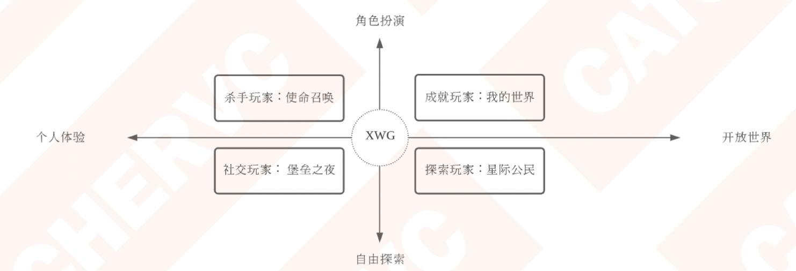

> _XWG 的玩家群体的游戏冲动原因较为广泛而并不突出。_

### **不足三: 通缩模型待改进**

- **快餐消费:** 对于 XWG 来说，应该专注于构建一个开放性全球化的二次元/ACG 文化、NFT 平台。又或者开发一个持续性经营游戏(Live Game)的 ARPG 游戏类型，并设计内耗高的代币消耗机制模型，并拉长投机者的回本周期和时间成本，这样会比快餐消费文化能更吸引到二次元/ACG 的区块链投资者和玩家

- **参考例子:** 在成功 NFT 项目(BAYC/AZUKI)和愈来愈火的 DAO 社群，都存在着强大的共识，包括项目背后的漫画、理念、故事，无不融合了来自全世界不同国家文化、宗教、民族的背景。特别是 DAO，更是打破了国界和语言的障碍，解放了劳动力和美元的压制。XWG 的叙事能力提高途径可以参考这类共识性强的项目，建设一个包容性和吸引用户的故事背景

- **引入装备系统:** 游戏产生的 LUCID 除了用来升级和质押 NFT 以平衡利益和产出以外，未来可以通过 V3 的游戏引入装备系统来进一步调控$XWG通胀率，利用卡牌NFT和装备NFT流动性低的特性来降低$XWG 的整体抛压

- **链上游戏:** 目前链游从第一代迎来了游戏引擎环境上链的想法或许会成为未来链游的发展方向，其优点包括无限的开发空间和开放给所有人围绕虚拟环境自由开发游戏和工具/装备。未来链上游戏的经济系统将非常复杂和偏向去中心自由交易，而目前仍没有成熟的基础建设和开发团队关注

> _二次元/ACG 本身也是多元文化组合体，二次元/ACG 的包容性与许多开发性游戏平台建设起来的基础文化基础相似，比如 Decentraland, The Sandbox(自由创作文化)，Dapper Labs 的 NBA Top Shot 系列(NBA 美国篮球文化), Sorare(足球俱乐部文化)。ACG 的代表如漫威漫画，迪士尼漫画，火影忍者等，也在全球风靡，足以说明 ACG 文化是能够被世界所接受通融的。相信进一步的加强叙事能力，改进游戏通胀模型能维持原本玩家的持有度并通过发布 V3/V4 等游戏吸引更多的活跃用户。_

## **二、分析框架**

---

本报告将从 GameFi 的多维度结合一些模型来剖析 XWG，其中维度和模型如下:

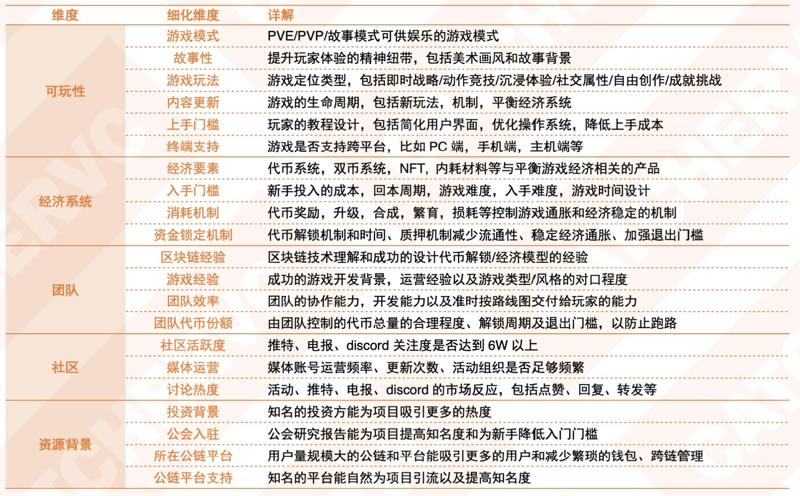
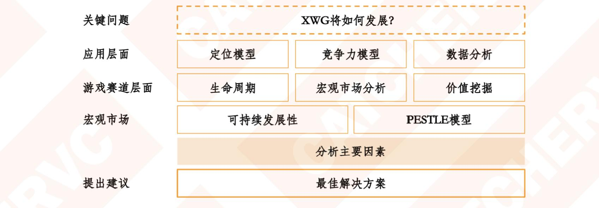

## **三、 多维度模型分析**

---

### **1. 定位模型及宏观分析可玩性**

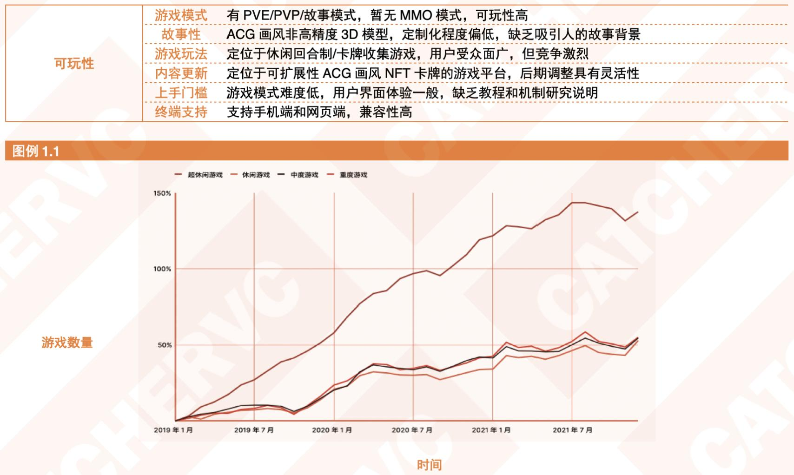
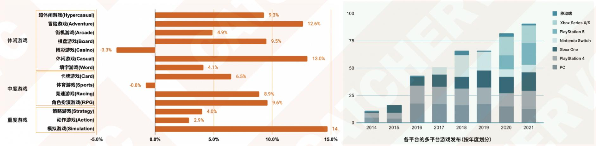

### 游戏行业概况

- **游戏行业爆发:** 各类游戏在 2021 年均因疫情在家原因，数量总增长了 50%
- **休闲游戏突出:** 超休闲游戏增加了 137%, 休闲游戏增长率有反超重度游戏的趋势
- **热门类型:** 冒险/休闲/模拟游戏在 2021 年均达到了 10%以上的年增长率, 超休闲，棋盘，竞速，RPG 达到 9%的年增长率
- **跨平台趋势:** 进驻 Xbox/PlayStation 等主机平台成为更多游戏的发展趋势

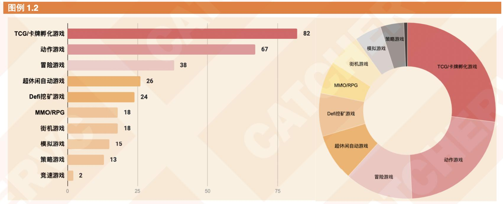

### 链游类型趋势

- 据 Footprint 数据总共录得 303 款热门链游，其中**回合制/卡牌孵化游戏，动作类游戏以及冒险游戏占据了几乎 62%**的游戏总量
- 链游并非像传统游戏在超休闲或休闲游戏开发上爆发，而是更多**着重于中度和重度游戏**
- **自动挖矿类型游戏火爆**，与 GameFi 的金融属性关联度高
- MMO、RPG、策略游戏、竞速游戏因为技术门槛和游戏长度，暂未有大量同类的游戏研发

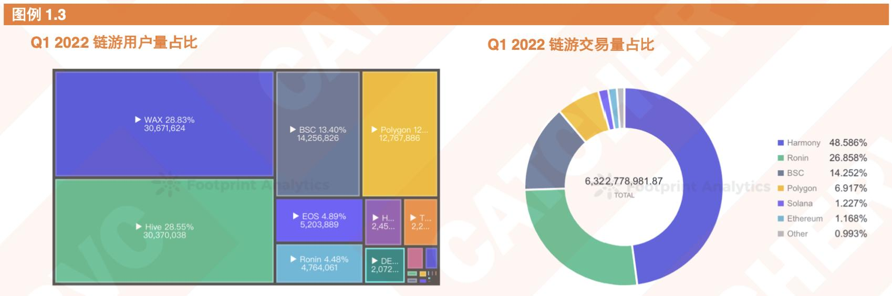

### 链游玩家占比

> 80%的链游玩家被 WAX、 Hive、 BSC、Polygon、EOS、Ronin 占领。其中:

- **[Splinterlands](https://splinterlands.com/):** Hive 上占据 99.9%玩家的策略棋牌游戏，拥有 30.34M 玩家
- **[Alien Worlds](https://alienworlds.io/):** WAX 上占据 57%玩家的 NFT 自动挖矿游戏, 拥有 17M 玩家
- **[Farmers World](https://farmersworld.io/):** WAX 上占据 44%玩家的 NFT 农场挖矿游戏, 拥有 8.4M 玩家
- **MOBOX, Secondlive, Bomb Crypto, XWG, The Crypto You** 占据了 BSC 上 12%的交易笔数
- **Sunflower Farmers, Crazydefense Heroes, Pegaxy, Arc8 by GAMEE** 占据了 Polygon 上的 25%的交易笔数
- **Upland** 占据了 EOS 的 50%的交易笔数，而 Ronin 则是 Axies Infinity 一家独占，DeFi Kingdoms 是 Harmony 的代表

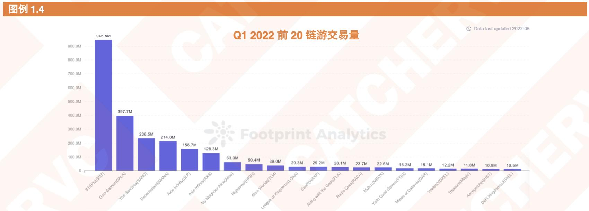

### 链游种类交易量趋势

- **STEPN:** 链游与线下运动结合的跑步社交游戏的代币 GMT 增长 22 倍, DAU 达 7 万人
- **GALA:** MOBA 类 Spider Tank，模拟经营 Town Star，元宇宙 Mirandus 让 Gala Games 游戏平台位居第二
- **元宇宙:** 以太坊上的元宇宙 Sandbox 和 Decentraland 位居第三第四,还有 My Neighbor Alice, Highstreet, SaaR, Radio Caca, Voxies 和 Aavegotchi
- **卡牌收集/TCG:** Axie Infinity 的 SLP 和 AXS 占据第 5 和第 6，Along with the Gods 占据第 12 和 DeFi Kingdoms 占据第 20
- **NFT 自动挖矿:** Alien Worlds, Mobox, Miners of Dalarinia 和 Treasure 亦获得较高交易量
- **MMO 策略:** League of Kingdom 占据第 10
- **公会:** YGG 交易量占据第 15

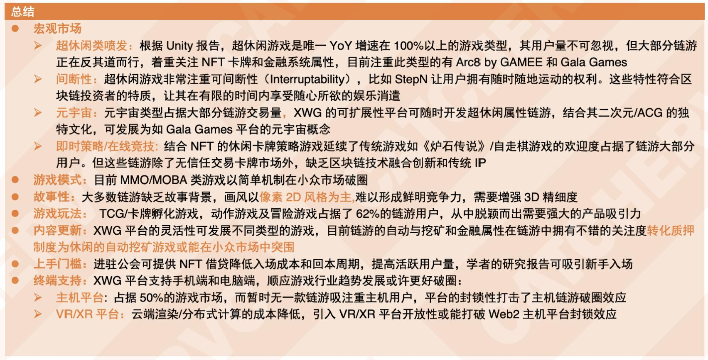

### **2. 经济系统分析**

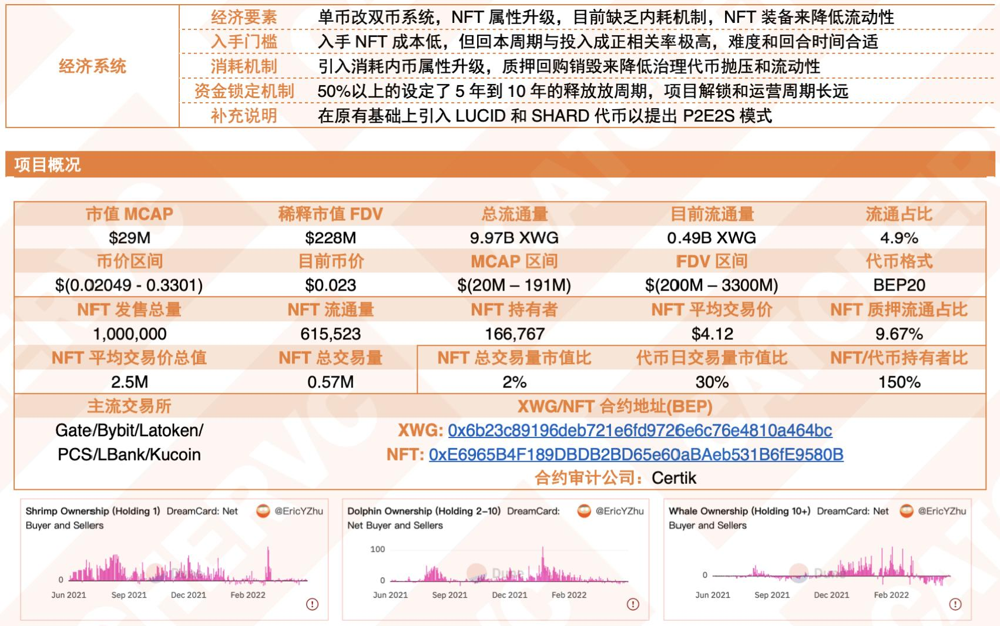

### 宏观分析

- **币价表现:** 目前代币价格与最高价回落 90%，与大部分链游表现相似，与 BTC 回落相比超跌
- **流通量:** 代币流通量可控，仅占 9%。表明币价和刺激机制仍可以进行灵活的后期调节
- **NFT 质押率:** 远低于代币质押率，仅占 6%。结合 Dune 链上数据表示，NFT 大户出逃并转移到小户手里，这表示 NFT 的正在良性循环。但是要注意控制大户的恐慌情绪并且考虑激励机制增加质押率
- **交易量与市值比:** 代币和 NFT 比例分别为 30%和 2%，因此 NFT 交易量不活跃
- **NFT/代币持有比:** NFT 持有者总量仅占代币持有者总量的 150%，NFT 散户较多

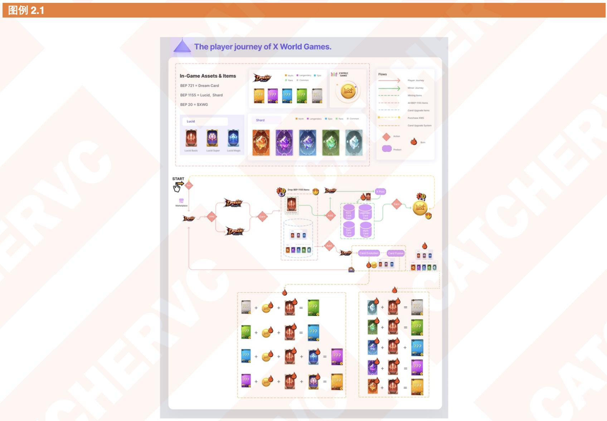

### 内循环机制

- 消耗 LUCID 升级 NFT 属性提高 NFT 收益率和减少回本周期
- 仅允许消耗 $XWG 和 LUCID 来突破持有 NFT 稀有度来进一步提高收益率
- 强制玩家通过投入时间成本赚取 LUCID 并消耗 LUCID 来获得质押赚取 $XWG 许可
- 否决氪金玩家与 DAU 产生失衡投入产出比例，从而改良系统的经济内循环
- 强制玩家和质押者数量趋向平衡(XWG 产出和消耗比达到动态平衡)
- 综上提高了代币消耗和燃烧效果，使治理代币通缩(释放<消耗)

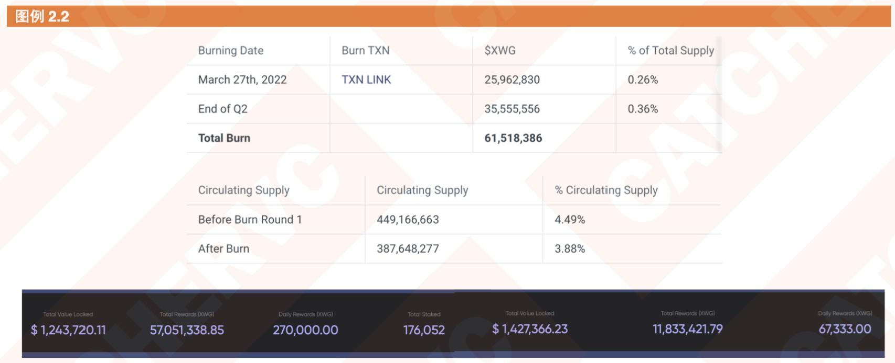

### 通缩机制分析

- XWG 于 2022 年第一季度末通过游戏内消费的代币和 50%盲盒的收入燃烧通缩治理代币价格
- 目前总共燃烧了 26M 代币，2022 年第二季度末预估燃烧 35.5M 代币
- 因此得出预测偏高的半年燃烧量 = **61,518,386 XWG 每半年**
- 目前 XWG 质押月释放 = (270,000+33,666)\* 30 天 = 9,109,980 XWG 每月
- 因此得出 XWG 质押半年释放 = 9,109,980\*6 个月 = 54,659,880 XWG 每半年
- 代币释放机制(计算为**半年月释放**):
- 种子轮 8%(5 年期每半年释放)=(总代币量*8%)/(5 年*2 次)=80,000,000 XWG 每半年
- 战略轮 17%(10%TGE, 5 年期每半年释放)=(总代币量*17%*90%)/(5 年\*2 次) =153,000,000 XWG 每半年
- 营销轮 5%(50%TGE,1 年期每季度释放)=2*(总代币量*5%*50%)/(1 年*4 次) =125,000,000 XWG 每半年
- 团队 9%(10 年期每半年释放)=(总代币量*9%)/(10 年*2 次)=45,000,000 XWG 每半年
- 潜在释放抛压为为 403M XWG 每半年 **358M XWG 除去团队**
- 由于目前除质押释放外各轮代币处于锁定状态，**燃烧 > 抛压**
- 通缩代币机制对比: **61.5M 半年燃烧量 > 抛压 54.6M**
- 假设价格团队稳定情况下，**各轮代币仅出售 1/2，即抛压为每半年 179M XWG 除去团队, 燃烧 < 抛压**

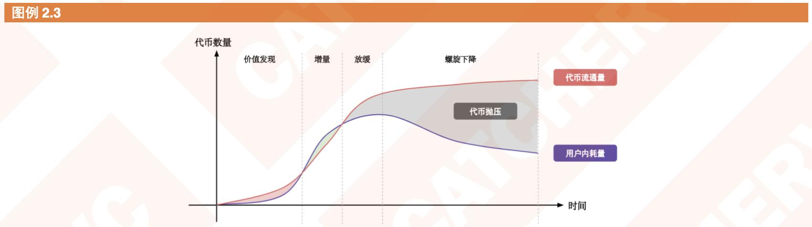
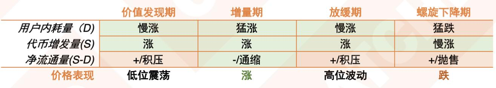

### 代币释放机制

- **革新机制:** 目前 XWG 的代币释放机制与大部分 Defi 项目无异，通过离散表格看到，在四个时期内仅有增量期释放机制会产生通缩效应
- **延长增量期:** 项目经济模型应该以延长增量期，延缓放缓期和螺旋下降期为目标
- **预防措施:** 通过抑制增量期用户增量和增速创造持久的通缩期
- **保险措施:** 通过发布新产品和流动性锁定功能防止放缓期进入螺旋下降期
- **补救措施:** 通过新增内耗机制和燃烧过剩流通量使净流通量为负或接近于 0

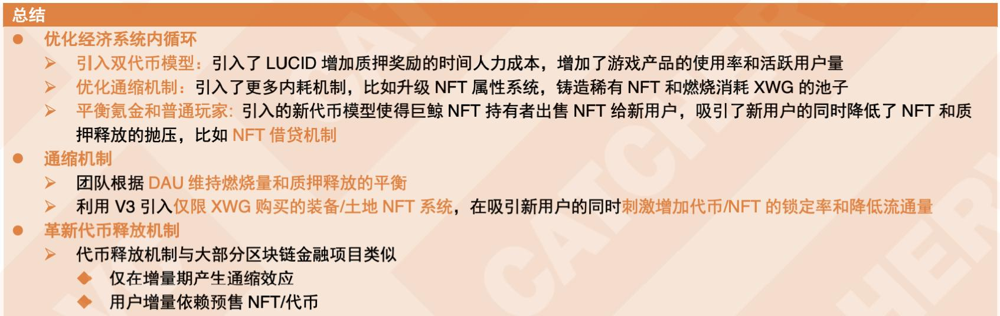

### **3. 结合产品生命周期分析团队**

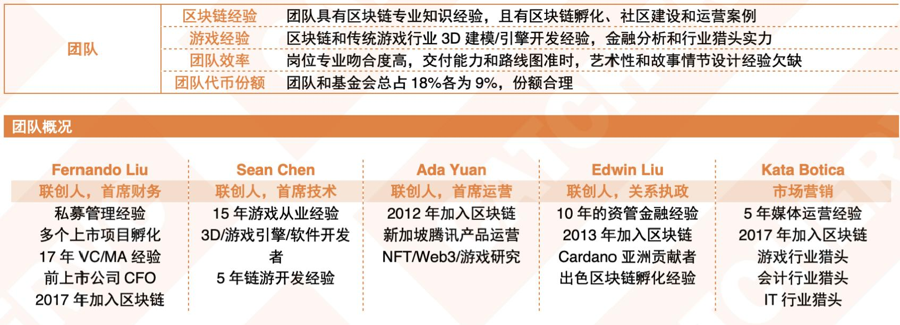

### 团队资源分析

- **金融背景:** 团队具有复合科技金融背景，有利于即时调节优化游戏内经济系统的设计和参数
- **区块链孵化经验:** 有丰富的区块链社区经营、产品开发、市场营销、人才招募的项目管理案例，大大提高 XWG 成功率并且与 XWG 平台和长周期的定位相符
- **稳定从业历史:** 联创人都有长期从业区块链的历史，这利于 XWG 在行业内进行资源整合
- **艺术/故事性:** 团队可以考虑加强加强 ACG 画风的资源并提高 XWG 在链游中独特的定位，包括招募漫画创作及设计故事之类的人才，这将有利于利用 XWG 的优势发展

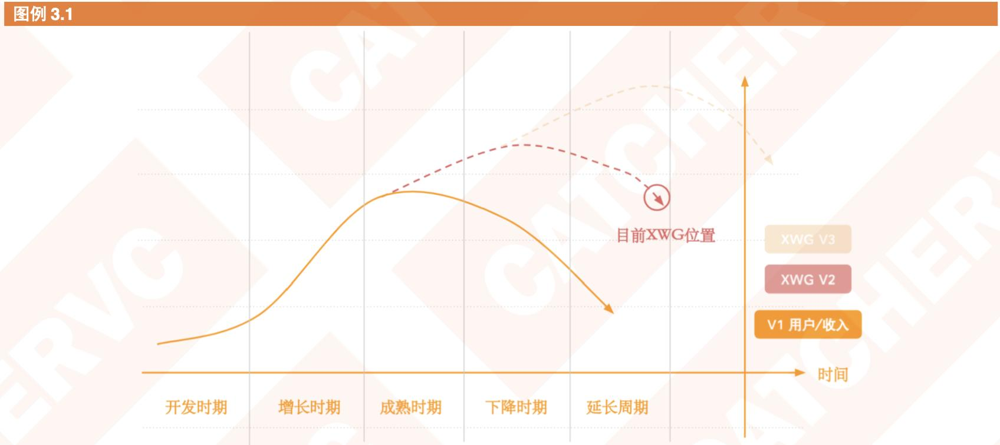

### 生命周期分析

- **目前状况:** XWG 处于 V1 和 V2 的下降时期和 V1 的延长周期，特点是用户量和用户粘性下降
- **原因分析:** 由于区块链资金的流动量大和投机特性，当前链游的 PLC 周期比传统游戏短
- **解决方案:** 不断的持续性更新和开发游戏内容，丰富故事和加强艺术属性可延缓这个时期的特性
- **延续时机:** 推出新内容和 V3 的时机上应当遵循 PLC 规律，团队着重研究产品回报周期与经济系统。引入装备/土地 NFT 减少治理代币流动性也有延缓投机者和活跃用户的退出时间的作用

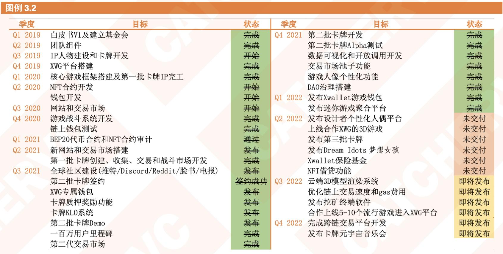

### 交付分析

- **交付能力强:** 由项目路线图交付完成完整度高
- **路线图偏短:** 项目的路线规划以年为目标，发展周期为 10 年的项目暂无明确年度目标
- **交付时间紧凑:** Q2/2022 季度交付目标目前延迟

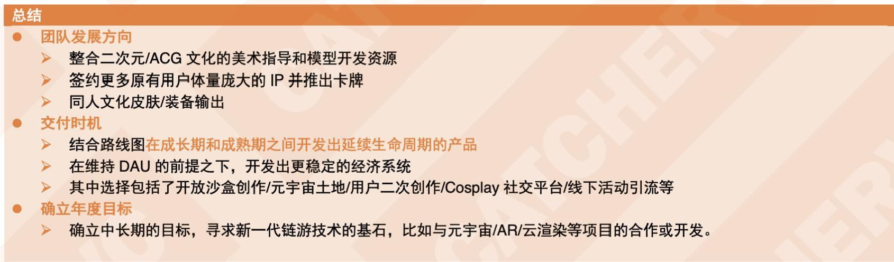

### **4. 社区运营分析**

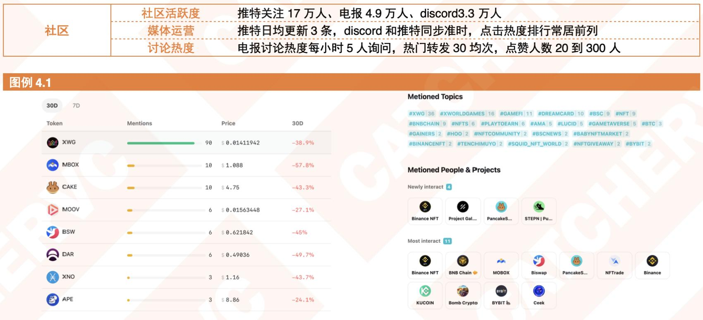

### 社区热度

- 推特提及度和热门话题讨论度高，与 Binance/GAL/STEPN 互动活跃
- 更新频率频繁，与 Discord 和电报同步
- 推特人数增长放缓

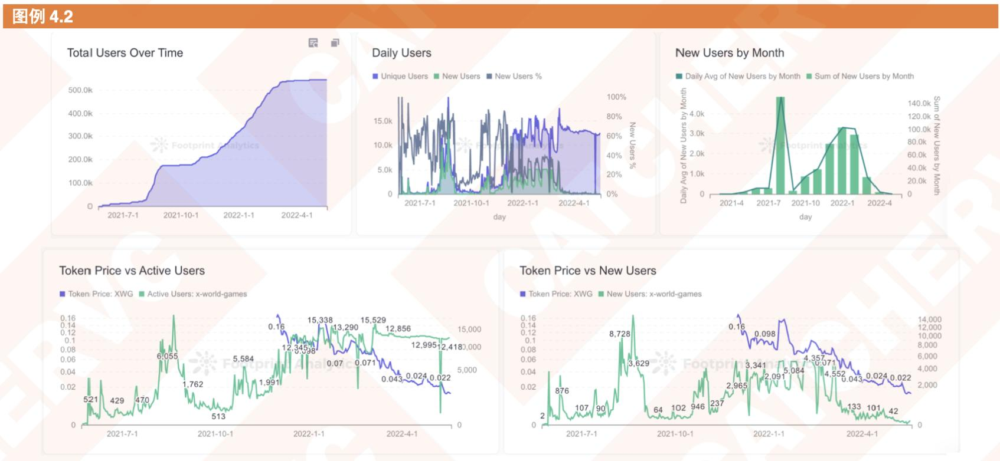

### 日活跃用户分析

- **概况:** 目前总用户 544,354 人，DAU 峰值 18,000 人，DAU 日均 12,500 人，DAU 留存率 2.27%
- **新增用户与生命周期:** 与 V1/V2 卡牌游戏发布的生命周期吻合，新增用户达到峰值后下降
- **新增用户与螺旋下降:** V2 用户增量于 22 年 1 月见顶后，XWG 价格因流通量通胀下跌
- **V1 峰值:** 配合 V1 卡牌游戏和 XWG 代币发布于 21 年 8 月达到了活跃用户峰值后迅速回落
- **V2 峰值:** 配合 V2 卡牌游戏和经济系统升级于 21 年 11 月至 22 年 1 月达到峰值，质押留存率高

### **5. 资源分析**

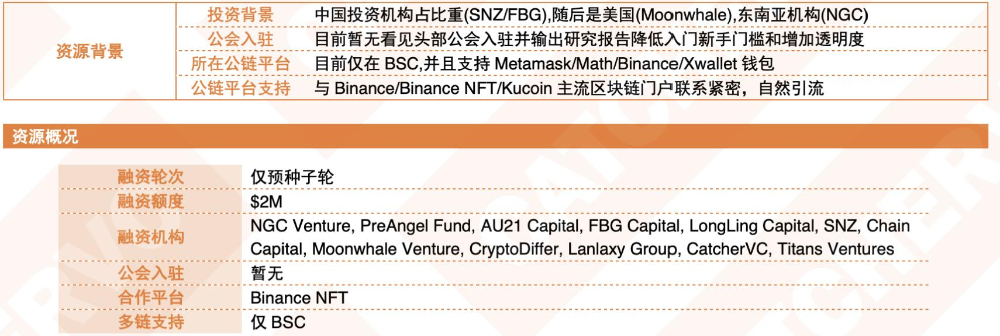

### **6. 总结 – 多维度模型量化**

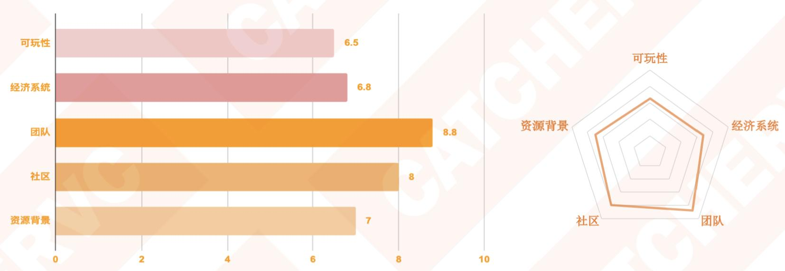

### 量化结论

- 团队，社区和资源背景较为均衡
- 强大的团队资源加强游戏可玩性和打磨更优良的经济系统
- 社区热度可吸引合作公会入驻，降低入门门槛
- 在 BSC 上的交易量和与用户占比依然庞大，有利于持续开发创新

## **四、 项目详解–竞争力分析**

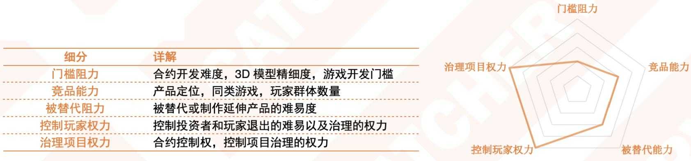

### 门槛阻力(较弱):

- 游戏模式简单容易被复刻
- 3D 模型精细度低，容易被反超
- 平台及合约代码门槛较难，开发者聘用成本高

### 竞品能力(中):

- 卡牌/策略/故事类链游趋于饱和，用户群体竞争激烈，与头部链游比 DAU 低
- 二次元/ACG 定位的同类产品未见与头部链游现象级别的爆发(AXS 和 STEPN)
- 同风格的链游或平台少，目前仍然是小众赛道
- 与传统同风格游戏相比竞争力弱，比如元神/崩坏等多平台支持的开放性网游

### 被替代阻力(中):

- 目前元宇宙概念将 SocialFi 和链游聚合，但基础设施少，头部平台仅支持网页端
- VR/XR 技术仍然处于萌芽期，便携性/设备成本/设备性能等不确定因素多
- XWG 平台的灵活性支持产品延伸至任何新兴替代品

### 控制玩家权力(强):

- 项目可调节激励参数和代币燃烧机制来控制玩家回报周期
- 可调节 NFT 交易市场的参数控制套利者的成本和利润
- 控制代币的释放锁定机制进行币价的宏观调节

### 治理项目权力(强)

- 游戏路线图和代币释放计划总规划 10 年，目前仅过了 1 年
- 合约所有权未销毁，在 Snapshot/Discourse 实现社区方案治理，团队拥有极大的控制权力
- 经济机制，游戏开发，上线合作等控制玩家的权力仍在团队手上

## **五、 项目估值因素及解决方案**

> 综上所述，XWG 平台的估值和解决方案需要考虑差异化定位，创新经济系统，资源整合和成本这四个重要的因素，详情如下:

### 差异化

- 加强二次元/ACG 文化特性，通过输出/合作/导入头部 IP 加强品牌平台效应提高竞争力
- 建立庞大世界观和故事性，提升艺术观感和游戏界面/可玩性体验
- 延伸元宇宙品牌合作/开发, 加入 VR/XR 设备和主机支持，提高被替代阻力
- 注重加强产品的技术入门门槛，通过社区的力量吸收并拉开同类竞品的距离

### 经济系统

- 游戏更新和产品开发延续增长期的通缩效应
- 融合 Defi 的创新技术，如衍生品，稳定币系统，AMM，ZK，NFT 借贷，装备 NFT 等
- 动态调节代币释放和燃烧参数，开发新经济系统使通缩期无限延长
- 开放社区型自治和游戏创作，让平台生命周期无限延长

### 资源整合

- 利用合作方和投资者资源，抢占更多未被链游捕捉的传统玩家和链游玩家的空隙
- 利用社区热度和社区粉丝，成立二次元/ACG 创作者聚合地，线上线下组织社区活动
- 寻找合作有利于游戏经济发展的公会，降低新手入门门槛
- 与头部二次元/ACG 传统游戏工作室/游戏合作，积累此行业内的人才资源

### 成本

- 路线图目标的开发成本和时间成本
- 社区治理成本和决策成本

### 1. 游戏平台竞品

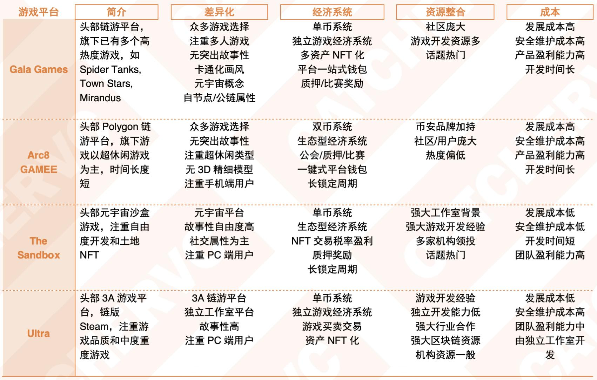

### 2. 游戏竞品

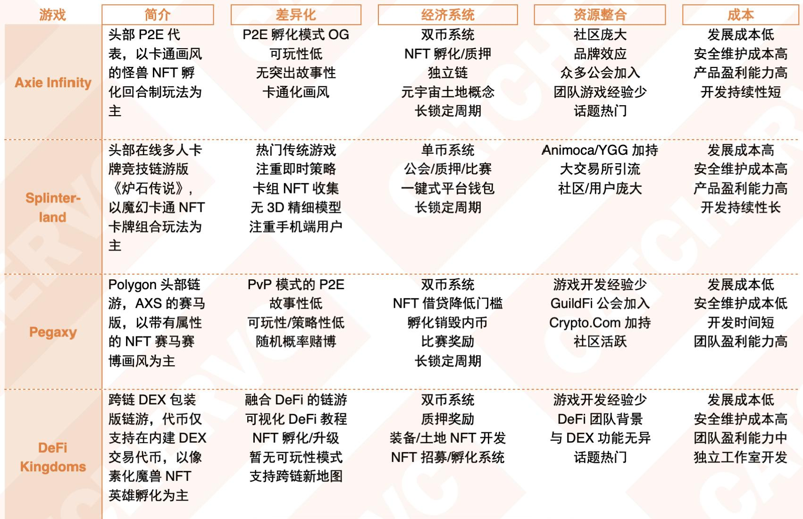

### 3. 潜在竞品估值方法

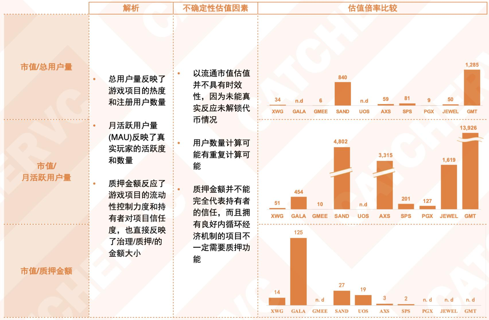
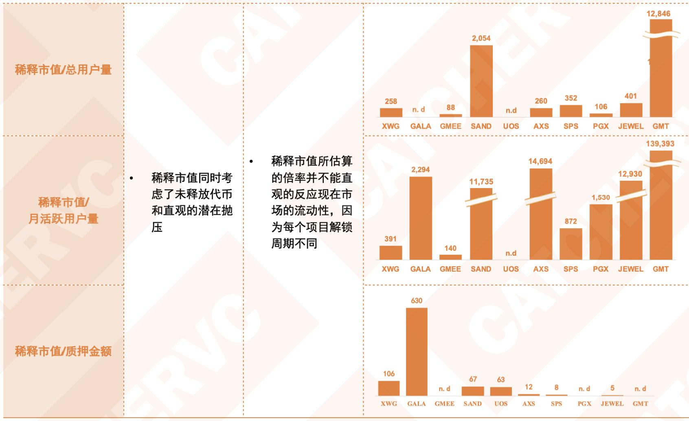

### 估值分析

- **市值:** 流通代币总市值，主要用于分析短期内持有者的对项目的估值
- **稀释市值:** 总发行代币市值，主要用于对比分析类似项目长期的估值情况
- **市值/总用户量:** 此倍率用于观察游戏流通市值较用户总数的估值情况，数值越大表示估值偏高风险高，数值越小表示估值偏小回报率高
- **市值/月活跃用户量:** 此倍率用于观察游戏流通市值较目前玩家热度的估值情况，数值越大表示用户情绪对市值的影响高，数值越小表示用户情绪对市值的影响小
- **市值/质押金额:** 此倍率用于观察短期内游戏流通市值较于社区质押金额的信心，数值越大表示社区对游戏的信心越大，数值越小表示社区对游戏的的信心越小
- **稀释市值/总用户量:** 此倍率用于观察游戏稀释市值较用户总数的估值情况，数值越大表示估值较同类项目偏高且下行风险高，数值越小表示估值较同类项目偏小且上行回报率高
- **稀释市值/月活跃用户量:** 此倍率用于观察游戏稀释市值较游戏玩家活跃度的估值情况，数值越大表示每个活跃用户对游戏的估值越高，数值越小每个活跃用户对游戏的估值越小
- **稀释市值/质押金额:** 此倍率用于观察游戏稀释市值较于社区质押金额的信心，数值越大表示项目的信誉度越大，数值越小表示项目的信誉度越小

### 4. 解决方案 – 路线图目标(100总分)

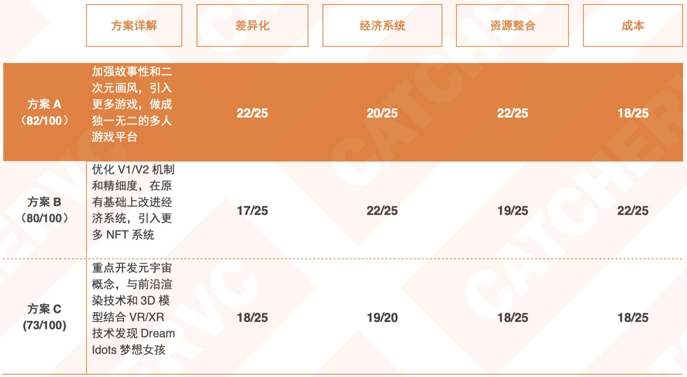
